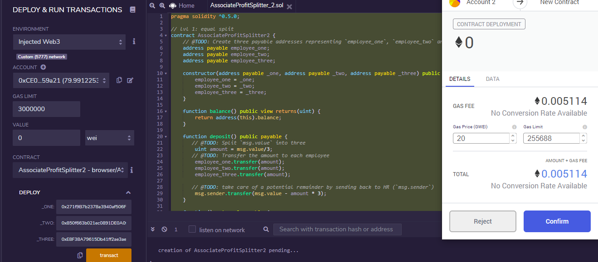
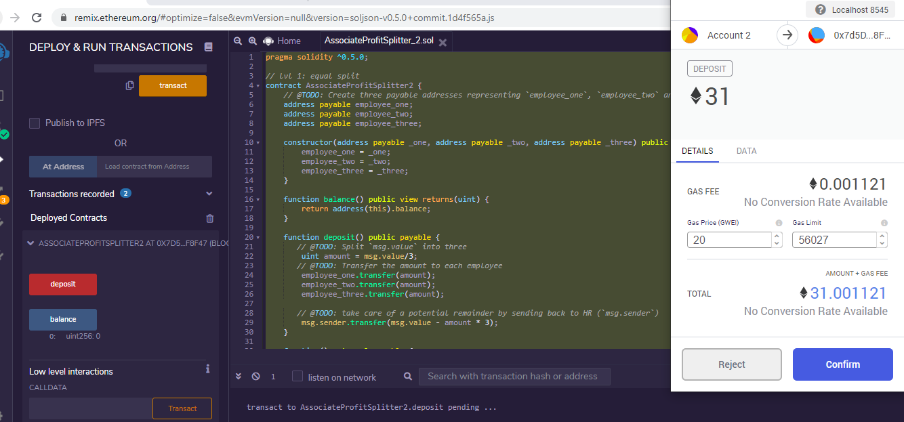
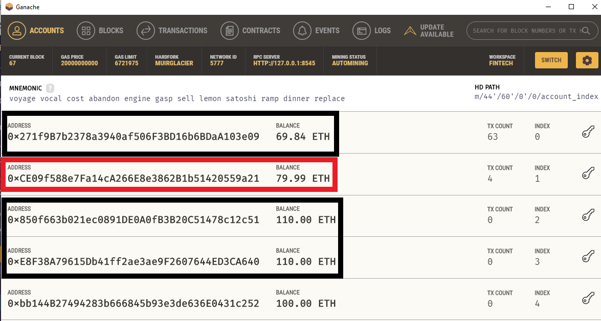
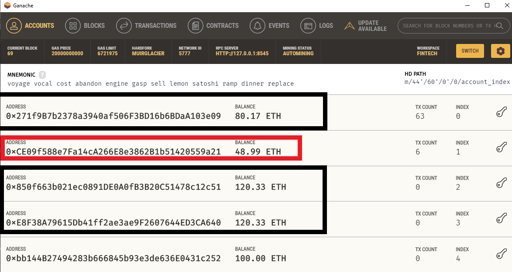
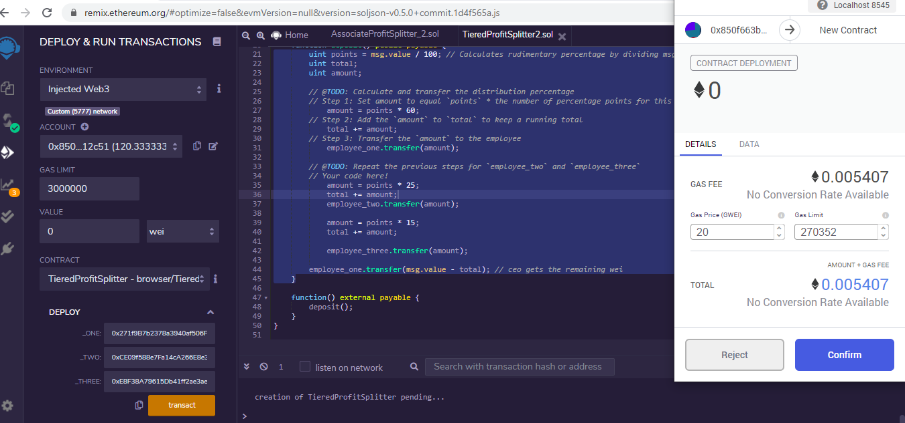
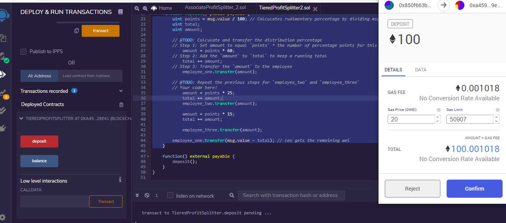
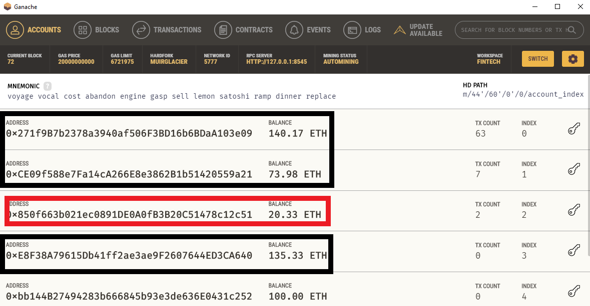
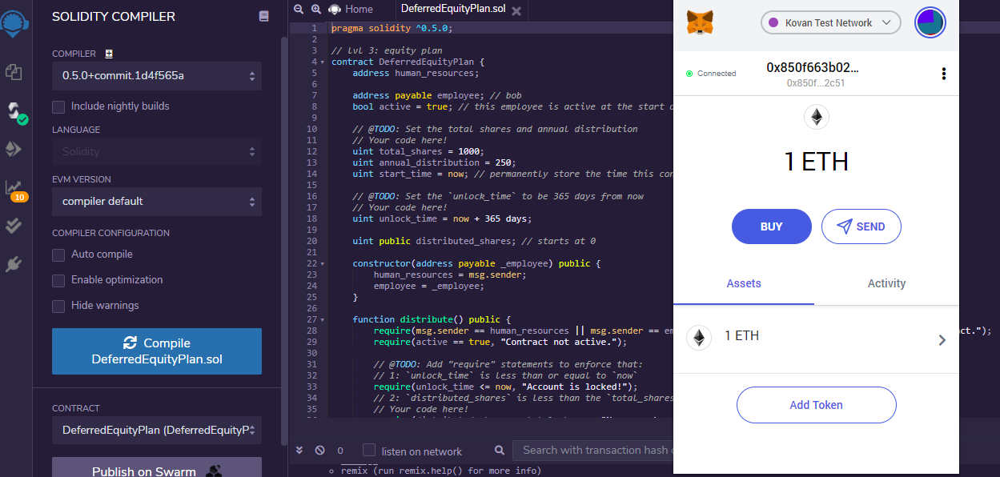
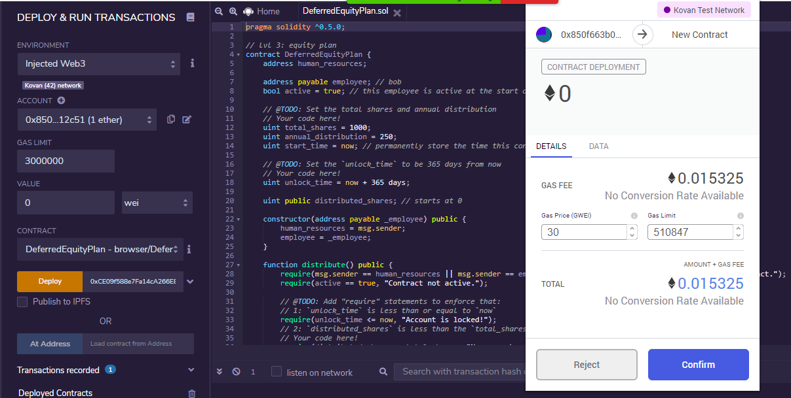

# Smart Contracts via Solidity

## <b> Background </b>

A new startup has created its own Ethereum-compatible blockchain to help connect financial institutions, and the team wants to build smart contracts to automate some company finances to make everyone's lives easier, increase transparency, and to make accounting and auditing practically automatic.

This problem can be solved using writing smart contracts with Solidity. I have created a few `ProfitSplitter` smart contracts which will automate some company finances.

## <b> Summary </b>

I have accomplished the following main tasks through deployment of three smart contracts. These contracts were built and executed by using three tools namely Ganache, Remix, MetaMask.

* I created an `AssociateProfitSplitter` contract. This will accept ether into the contract, and divide it evenly among associate-level employees. This will allow the human resources department to pay employees quickly and efficiently.

* Next, I created a `TieredProfitSplitter` contract that will distribute different percentages of incoming ether to employees at different tiers/levels. For example, the CEO gets paid 60%, CTO 25%, and Bob gets 15%.

* Finally, `DeferredEquityPlan` contract was created that models traditional company stock plans. This contract will automatically manage 1000 shares, with an annual distribution of 250 shares over four years for a single employee.

## <b> Files locations in GitHub </b>

1. I have created a repository called `Smart-Contract` in the Github.
2. Inside the above there is folder named `Code` which has all the three contracts along with DeferredEquityPlan contract which was tested on the timelock functionality:
* [`AssociateProfitSplitter.sol`](Code/AssociateProfitSplitter.sol)
* [`TieredProfitSplitter.sol`](Code/TieredProfitSplitter.sol)
* [`DeferredEquityPlan.sol`](Code/DeferredEquityPlan.sol)
* [`DeferredEquityPlan_Fake.sol`](Code/DeferredEquityPlan-Fake.sol)
## <b> Details on each tasks </b>

### <b> Level One: The `AssociateProfitSplitter` Contract </b>
This will accept ether into the contract, and divide it evenly among associate-level employees. The contract has following elements and functions:
* Address Payable for three employees.
* Constructor function that accepts three addresses and sets the employee addresses to equal the parameter values. This will take care of hardcoding the employee addresses.
* Balance function which returns the contract's current balance which is always `0` as remainders amounts are taken care of.
* Deposit function which is `public payable` to ensure that only the owner can call the function. This also includes division, deposit of the ether value among three employees equally, takes care of the remainder amount and sends back to the HR.
* Fallback function which is `external payable` and calls the `deposit` function from within it. This will ensure that the logic in `deposit` executes if ether is sent directly to the contract. This is important to prevent ether from being locked in the contract, since we don't have a `withdraw` function in this use case.

#### <b> Testing the contract </b>

After compiling the code in Remix, I deployed the contract to local Ganache chain by connecting to `Injected Web3` and ensured MetaMask was pointed to `localhost:8545`, with 0 wei. There was a fee charged to the Ether account.

Next as the contract was activated, I filled the constructor parameters with designated addresses and tested the `deposit` functionality by transferring 31 Ether from account 2 into the accounts 1, 3 and 4.

I checked the movement in balances/funds in Ganache before and after, it shows 31 Ether was taken from Account 2 and deposited equally into accounts 1, 3 and 4.

### Level Two: The `TieredProfitSplitter` Contract

In this contract, rather than splitting the profits between associate-level employees, I have calculated percentages for different tiers of employees (60% for CEO, 25% for CTO, and 15% for Bob). The contract has following elements and functions:
* Address Payable for three employees, functions - constructor, balance and fallback remain same as described in AssociateProfitSplitter contract.
* However, Deposit function now includes a). calculation of points/units by dividing `msg.value` by `100` which will allow to multiply the points with a number representing a percentage b) `uint amount` variable will be used to store the amount to send each employee temporarily c) calculation of amount to be paid to each employee (number of `points` multiplied by the percentage of share) and d) send the remainder amount to the CEO/ employee one.

  * Note: I have used 100 ether threshold due to the way I calculated the points. If we send less than 100 ether, for example, 80 ether/wei, `points` would equal `0` because `80 / 100` equals `0` because the remainder is discarded. 

#### <b> Testing the contract </b>

After compiling the code in Remix, I deployed the contract to local Ganache chain by connecting to `Injected Web3` and ensured MetaMask was pointed to `localhost:8545`, with 0 wei. There was a fee charged to the Ether account.

Next as the contract was activated, I filled the constructor parameters with designated addresses and tested the `deposit` functionality by transferring 100 Ether from account 3 into the accounts 1, 2 and 4.

I checked the movement in balances/funds in Ganache before and after, it shows 31 Ether was taken from Account 3 and deposited at a ratio of 60%, 25% and 15% to accounts 1, 2 and 4 respectively, minus the gas.

### <b> Level Three: The `DeferredEquityPlan` Contract </b>

In this contract, I have created an employee's "deferred equity incentive plan," in which 1000 shares will be distributed over four years to the employee. I will not deal with ether in this contract, but will be storing and setting amounts that represent the number of distributed shares the employee owns, and enforcing the vetting periods automatically.

* **Details on deferred equity incentive plans:** In this set-up, employees receive shares for joining and staying with the firm. They may receive, for example, an award of 1000 shares when joining, but with a four-year vesting period for these shares. This means that these shares would stay with the company, with only 250 shares (1000/4) actually distributed to and owned by the employee each year. If the employee leaves within the first four years, he or she would forfeit ownership of any remaining (“unvested”) shares.

The contract has following elements and functions:

* Address for HR, address Payable for employee, Bool active for active employee, uint total_shares as 1000, uint annual_distribution as 250, uint start_time as now to permanently store the time the contract was initialized, unlock_time to be 365 days from now and uint public distributed_shares to start as 0
* constructor - since HR will be deploying the contract
* function distribute - this will take care of how the shares are distributed including require statements for basic checks, calculation of next year's unlock time before distributing this year's shares, setting of the new value for `distributed_shares` by calculating how many years have passed since `start_time` multiplied by `annual_distributions`, calculation of `distributed_shares` [(now - start_time)/`365 days` * annual distribution]. It also includes checks in the case the employee does not cash out until 5+ years after the contract start, since the contract does not reward more than the `total_shares` agreed upon in the contract.
* function deactivate  - human_resources and the employee can deactivate this contract at-will
* Since we do not need to handle Ether in this contract, revertded any Ether sent to the contract directly

#### <b> Testing the contract </b>
This was done in below step manner. 

<i> Step 1 </i>: Deployed and tested the contract locally
* For this contract, I tested the timelock functionality by adding a new variable called `uint fakenow = now;` as the first line of the contract, then replaced every other instance of `now` with `fakenow`. Created the `fastforward` function to manipulate `fakenow` during testing. [ <i> function fastforward() public {fakenow += 100 days;} </i> ]. 
* After compiling this test code in Remix, I deployed the contract to local Ganache chain by connecting to `Injected Web3` and ensured MetaMask was pointed to `localhost:8545`, with 0 wei. There was a fee charged to the Ether account. However, I was able to transact only the 4th time when the timelock functionality was activated. 

<i> Step 2 </i>: Deployed the contract to a live Testnet "Kovan"
* Now I pointed MetaMask to Kovan, deployed the contract on "Kovan" network as before after ensuring I had transferred 1 ETH to the account 3 on this network!

* Next I deployed in the same fashion as done previously 

* I am unable to transfer because the fakenow was removed and I can only distribute the shares when 365 days have passed.

* Finally The transactions will also be in my MetaMask history, and on the blockchain permanently to explore later.

