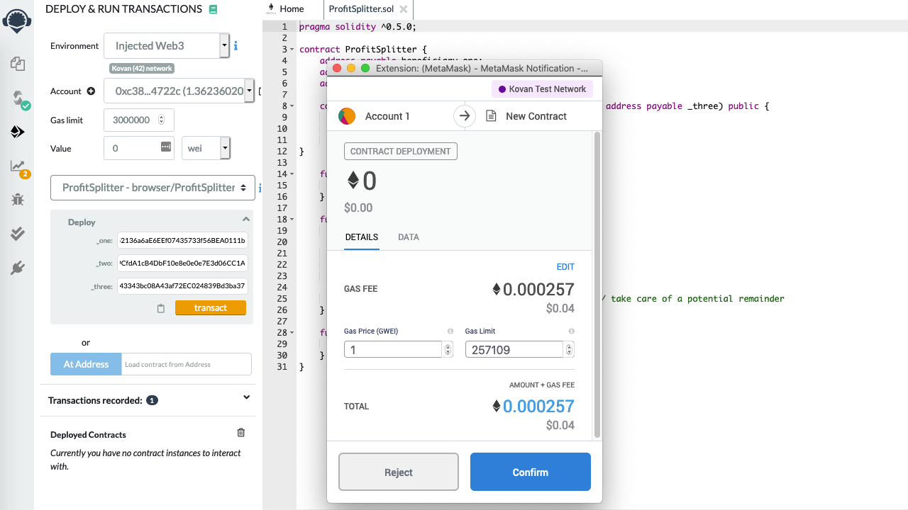

# Unit 20 | Smart Contracts via Solidity


## <b> Background </b>

A new startup has created its own Ethereum-compatible blockchain to help connect financial institutions, and the team wants to build smart contracts to automate some company finances to make everyone's lives easier, increase transparency, and to make accounting and auditing practically automatic.

This problem can be solved using writing smart contracts with Solidity. I have created a few `ProfitSplitter` smart contracts which will automate some company finances.

## <b> Summary </b>

I have accomplished the following main tasks through deployment of three smart contracts. These contracts were built and executed by using three tools namely Ganache, Remix, MetaMask.

* I created a `AssociateProfitSplitter` contract. This will accept ether into the contract, and divide it evenly among associate-level employees. This will allow the human resources department to pay employees quickly and efficiently.

* Next, I created a `TieredProfitSplitter` contract that will distribute different percentages of incoming ether to employees at different tiers/levels. For example, the CEO gets paid 60%, CTO 25%, and Bob gets 15%.

* Finally, `DeferredEquityPlan` contract was created that models traditional company stock plans. This contract will automatically manage 1000 shares, with an annual distribution of 250 shares over four years for a single employee.

## <b> Files locations in Github </b>

1. I have created a repository called `Smart-Contract` in the Github.
2. Inside the above there is folder named `Code` which has all the three contracts
* [`AssociateProfitSplitter.sol`](Code/AssociateProfitSplitter.sol)
* [`TieredProfitSplitter.sol`](Starter-Code/TieredProfitSplitter.sol)
* [`DeferredEquityPlan.sol`](Starter-Code/DeferredEquityPlan.sol)

## <b> Details on each tasks </b>

### <b> Level One: The `AssociateProfitSplitter` Contract </b>
This will accept ether into the contract, and divide it evenly among associate-level employees. The contract has following elements and functions:
* Address Payable for three employees.
* Constructor function that accepts three addresses and sets the employee addresses to equal the parameter values. This will take care of hardcoding the employee addresses.
* Balance function which return the contract's current balance which is always `0` as remainders amounts are taken care of.
* Deposit function which is `public payable` to ensure that only the owner can call the function. This also includes division, deposit of the ether value among three employees equally, takes care of the remainder amount and sends back to the HR.
* Fallback function which is `external payable` and calls the `deposit` function from within it. This will ensure that the logic in `deposit` executes if ether is sent directly to the contract. This is important to prevent ether from being locked in the contract, since we don't have a `withdraw` function in this use case.

#### <b> Testing the contract </b>

After compiling the code in Remix, I deployed the contract to local Ganache chain by connecting to `Injected Web3` and ensured MetaMask was pointed to `localhost:8545`, with 0 wei. There was a fee charged to the Ether account.


Next as the contract was activated, I filled the constructor parameters with designated addresses and tested the `deposit` functionality by transferring 31 Ether into the accounts 1, 3 and 5.


I checked the movement in balances/funds in Ganache before and after, it shows 31 Ether was taken from Account 2 and deposited equally into accounts 1, 3 and 4.


### Level Two: The `TieredProfitSplitter` Contract

In this contract, rather than splitting the profits between associate-level employees, I have calculated percentages for different tiers of employees (60% for CEO, 25% for CTO, and 15% for Bob). The contract has following elements and functions:
* Address Payable for three employees, functions - constructor, balance and fallback remain same as described in AssociateProfitSplitter contract.
* Deposit function which is `public payable` to ensure that only the owner can call the function. This now includes a). calculation of points/units by dividing `msg.value` by `100` which will allow to multiply the points with a number representing a percentage b) `uint amount` variable will be used to store the amount to send each employee temporarily c) calculation of amount to be paid to each employee (number of `points` multiplied by the percentage of share) and d) send the remainder amount to the CEO/ employee one.

  * Note: I have used 100 ether threshold due to the way I calculated the points. If we send less than 100 ether, for example, 80 ether/wei, `points` would equal `0` because `80 / 100` equals `0` because the remainder is discarded. 

#### <b> Testing the contract </b>

After compiling the code in Remix, I deployed the contract to local Ganache chain by connecting to `Injected Web3` and ensured MetaMask was pointed to `localhost:8545`, with 0 wei. There was a fee charged to the Ether account.


Next as the contract was activated, I filled the constructor parameters with designated addresses and tested the `deposit` functionality by transferring 100 Ether from account 3 into the accounts 1, 2 and 4.


I checked the movement in balances/funds in Ganache before and after, it shows 31 Ether was taken from Account 2 and deposited equally into accounts 1, 3 and 5.


### Level Three: The `DeferredEquityPlan` Contract

In this contract, we will be managing an employee's "deferred equity incentive plan," in which 1000 shares will be distributed over four years to the employee. We won't need to work with ether in this contract, but we will be storing and setting amounts that represent the number of distributed shares the employee owns, and enforcing the vetting periods automatically.

* **A two-minute primer on deferred equity incentive plans:** In this set-up, employees receive shares for joining and staying with the firm. They may receive, for example, an award of 1000 shares when joining, but with a four-year vesting period for these shares. This means that these shares would stay with the company, with only 250 shares (1000/4) actually distributed to and owned by the employee each year. If the employee leaves within the first four years, he or she would forfeit ownership of any remaining (“unvested”) shares.

  * If, for example, the employee only sticks around for the first two years before moving on, the employee’s account will end up with 500 shares (250 shares * 2 years), with the remaining 500 shares staying with the company. In this example, only half of the shares (and any distributions of company profit associated with them) actually “vested,” or became fully owned by the employee. The remaining half, which were still “deferred” or “unvested,” ended up fully owned by the company since the employee left midway through the incentive/vesting period.

  * Specific vesting periods, the dollar/crypto value of shares awarded, and the percentage equity stake (the percentage ownership of the company) all tend to vary according to the company, the specialized skills, or seniority of the employee, and the negotiating positions of the employee/company. If you receive an offer from a company offering equity (which is great!), just make sure you can clarify the current dollar value of those shares being offered (based on, perhaps, valuation implied by the most recent outside funding round). In other words, don’t be content with just receiving “X” number of shares without having a credible sense of what amount of dollars that “X” number represents. Be sure to understand your vesting schedule as well, particularly if you think you may not stick around for an extended period of time.

Using the starter code, perform the following:

* Human resources will be set in the constructor as the `msg.sender`, since HR will be deploying the contract.

* Below the `employee` initialization variables at the top (after `bool active = true;`), set the total shares and annual distribution:

  * Create a `uint` called `total_shares` and set this to `1000`.

  * Create another `uint` called `annual_distribution` and set this to `250`. This equates to a four-year vesting period for the `total_shares`, as `250` will be distributed per year. Since it is expensive to calculate this in Solidity, we can simply set these values manually. You can tweak them as you see fit, as long as you can divide `total_shares` by `annual_distribution` evenly.

* The `uint start_time = now;` line permanently stores the contract's start date. We'll use this to calculate the vested shares later. Below this variable, set the `unlock_time` to equal `now` plus `365 days`. We will increment each distribution period.

* The `uint public distributed_shares` will track how many vested shares the employee has claimed and were distributed. By default, this is `0`.

* In the `distribute` function:

  * Add the following `require` statements:

    * Require that `unlock_time` is less than, or equal to, `now`.

    * Require that `distributed_shares` is less than the `total_shares` the employee was set for.

    * Ensure to provide error messages in your `require` statements.

  * After the `require` statements, add `365 days` to the `unlock_time`. This will calculate next year's unlock time before distributing this year's shares. We want to perform all of our calculations like this before distributing the shares.

  * Next, set the new value for `distributed_shares` by calculating how many years have passed since `start_time` multiplied by `annual_distributions`. For example:

    * The `distributed_shares` is equal to `(now - start_time)` divided by `365 days`, multiplied by the annual distribution. If `now - start_time` is less than `365 days`, the output will be `0` since the remainder will be discarded. If it is something like `400` days, the output will equal `1`, meaning `distributed_shares` would equal `250`.

    * Make sure to include the parenthesis around `now - start_time` in your calculation to ensure that the order of operations is followed properly.

  * The final `if` statement provided checks in the case the employee does not cash out until 5+ years after the contract start, the contract does not reward more than the `total_shares` agreed upon in the contract.

* Deploy and test your contract locally.

  * For this contract, test the timelock functionality by adding a new variable called `uint fakenow = now;` as the first line of the contract, then replace every other instance of `now` with `fakenow`. Utilize the following `fastforward` function to manipulate `fakenow` during testing.

  * Add this function to "fast forward" time by 100 days when the contract is deployed (requires setting up `fakenow`):

    ```solidity
    function fastforward() public {
        fakenow += 100 days;
    }
    ```

  * Once you are satisfied with your contract's logic, revert the `fakenow` testing logic.

* Congratulate yourself for building such complex smart contracts in your first week of Solidity! You are learning specialized skills that are highly desired in the blockchain industry!

### Deploy the contracts to a live Testnet

Once you feel comfortable with your contracts, point MetaMask to the Kovan or Ropsten network. Make sure that you have test ether on this network!

After switching MetaMask to Kovan, deploy the contracts as before, and copy/keep a note of their deployed addresses. The transactions will also be in your MetaMask history, and on the blockchain permanently to explore later.



## Submission

Create a `README.md` that explains what testnet the contract is on, the motivation for the contract.
Upload this to a Github repository that explains how the contract works, and provide the testnet address for others to be able to send to.

